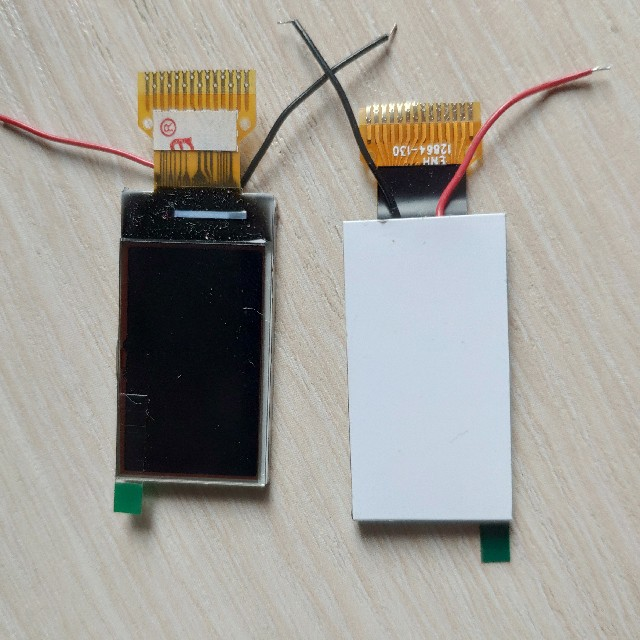
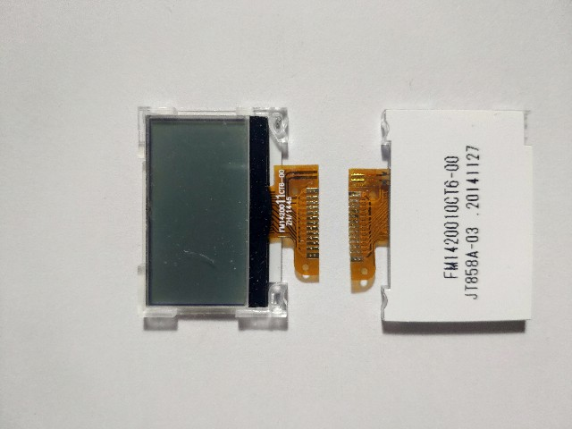
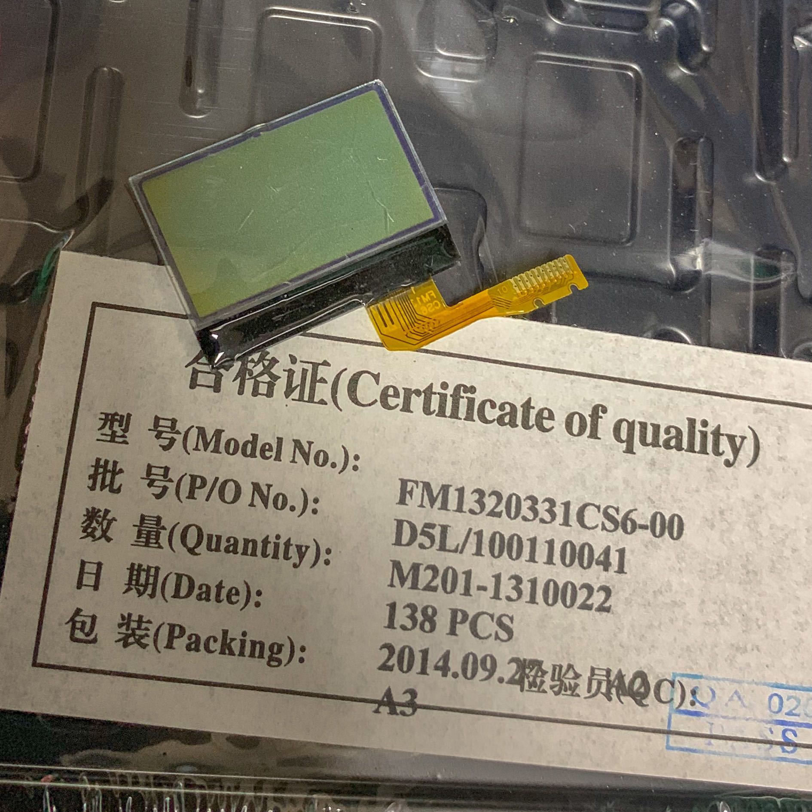

# drive-various-lcd

## Modules

* ENH12864-130

* FM14200(FM1420011CT6/FM1420010CT6)

* FM1320330(FM1320331CS6-00)

* SGP18T|ILI9163

## Driver libs

* u8g2 ucglib
* adafruit GFX
* sparkfun HyperDisplay

* [SPI_LCD](https://github.com/bitbank2/SPI_LCD) SSD1351, ST7735, ILI9341 or HX8357
 
* https://github.com/sparkfun/HyperDisplay_ILI9163C_ArduinoLibrary

* https://github.com/sumotoy/TFT_ILI9163C

* https://github.com/Bodmer/TFT_ILI9163
